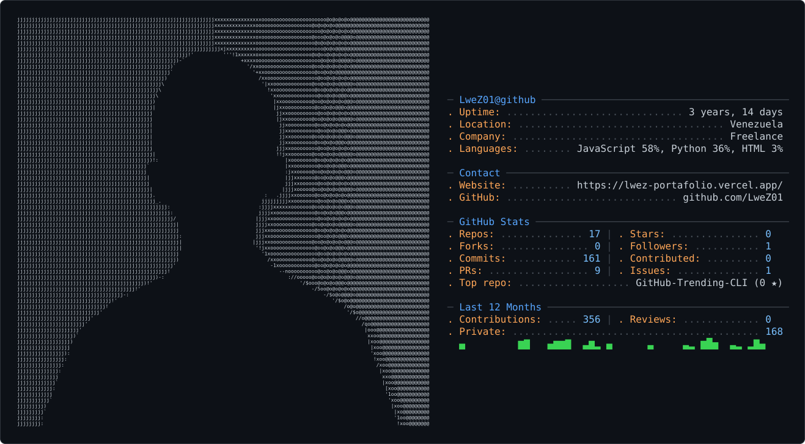

<picture>
  <source media="(prefers-color-scheme: dark)" srcset="dark_mode.svg" />
  <source media="(prefers-color-scheme: light)" srcset="light_mode.svg" />
  
</picture>

###

  <!-- Backend & Languages -->
  

    
    
    
    
    
    
    
    
    
    
    
    
    
  

   

  <!-- Data, Infrastructure & Frontend -->
  

    
    
    
    
    
    
    
    
    
    
    
    
    
  

###

  
  
  
  
  

###

 

###

<picture>
  <source media="(prefers-color-scheme: dark)" srcset="https://raw.githubusercontent.com/LweZ01/LweZ01/output/pacman-contribution-graph-dark.svg">
  <source media="(prefers-color-scheme: light)" srcset="https://raw.githubusercontent.com/LweZ01/LweZ01/output/pacman-contribution-graph.svg">
  
</picture>

###
